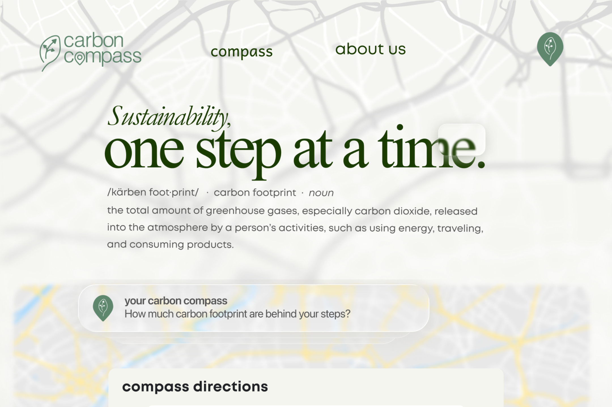
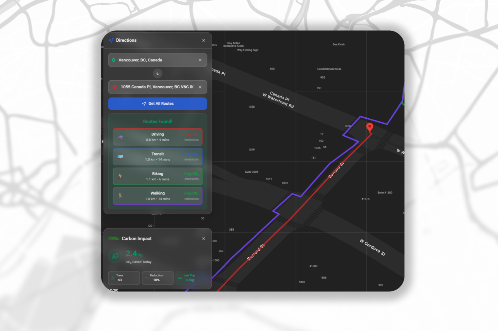

<div align="center">

# 🌍 Carbon Compass

*A smart route planning application that helps users make environmentally conscious travel decisions by calculating and comparing carbon emissions across different transportation modes.*

<div align="center">
  
  
</div>

<p align="center">
  
</p>

</div>

## Table of Contents

- [📖 About](#-about)
- [🔗 Links](#-links)
- [🧮 Carbon Emission Calculations](#-carbon-emission-calculations)
- [🛠️ Tech Stack](#️-tech-stack)
- [📁 Project Structure](#-project-structure)
- [📋 Technical Requirements](#-technical-requirements)
- [🚀 Getting Started (Local Hosting)](#-getting-started-local-hosting)
- [🎯 Usage](#-usage)
- [📡 API Endpoints](#-api-endpoints)
- [📄 License](#-license)
- [🙏 Acknowledgments](#-acknowledgments)

## 📖 About

Carbon Compass is an interactive web application that empowers users to reduce their environmental impact through informed transportation choices. Simply enter your origin and destination, and our app will show you multiple route options with their respective carbon footprints, helping you choose the most sustainable way to travel.

## 🔗 Links
- Deployment
  - [Vercel](https://carboncompass.vercel.app)
- Figma
  - [Info Slides](https://www.figma.com/slides/P7BmahOT0D769zal3DFAEu/Carbon-Compass-Slide-Deck?node-id=1-159)
  - [Web Design Page](https://www.figma.com/design/zQcdtgZLi25XymW7xE9iBE/Carbon-Compass-Landing-FINAL?node-id=0-1&p=f)

### Key Features

- **Multi-Modal Route Planning**: Compare walking, cycling, public transit, and driving options
- **Real-Time Carbon Calculations**: See estimated CO₂ emissions for each transportation mode
- **Interactive Map Interface**: Visualize routes and make selections directly on the map
- **Live Weather Integration**: Real-time weather data powered by Open-Meteo API with automatic geolocation
- **Trip Tracking**: Track your journey in real-time with live location updates
- **Responsive Design**: Optimized for both desktop and mobile devices
- **Dark Mode Support**: Comfortable viewing in any lighting condition

## 🧮 Carbon Emission Calculations

Our carbon footprint calculations are based on established emission factors for different transportation modes:

### Transportation Mode Emission Factors

| Transportation Mode        | Emission Factor (g CO₂e/km) | Notes                                           |
| :------------------------: | :-------------------------: | ----------------------------------------------- |
| **Walking**                | 0                           | No direct emissions                             |
| **Cycling**                | 0                           | No direct emissions  |
| **Public Transit**         | 89                          | Average bus/train occupancy considered          |
| **Driving (Gasoline Car)** | 210                         | Based on average fuel consumption of 8.0L/100km |

### Calculation Method

For each route, we calculate emissions using:

```
Total Emissions (g CO₂e) = Distance (km) × Emission Factor (g CO₂e/km)
```

_Note: These estimates are for educational purposes and may vary based on actual vehicle efficiency, occupancy rates, and regional energy sources._

## 🛠️ Tech Stack

### Frontend

- **React.js 19.2.0** with **Vite 7.1.9** - Modern React development environment
- **TailwindCSS v3.4.17** - Utility-first CSS framework for styling
- **PostCSS 8.4.49** with **Autoprefixer** - CSS processing pipeline
- **Google Maps JavaScript API** - Interactive maps and route visualization
- **Lucide React** - Modern icon library

### Backend

- **Node.js** with **Express.js** - Server-side JavaScript runtime and web framework
- **Google Maps Directions API** - Route calculation and distance data
- **CORS** - Cross-origin resource sharing support

### Weather Integration

- **Open-Meteo API** - Free, open-source weather forecasting (no API key required)
- **OpenStreetMap Nominatim** - Reverse geocoding for location names
- **Browser Geolocation API** - Automatic location detection
- **Auto-refresh** - Weather updates every 10 minutes

## 📁 Project Structure

This project follows a monorepo structure with separate client and server applications, built with SOLID principles and modular architecture:

```
CarbonCompass/
├── 📁 client/                        # Frontend React application
│   ├── 📁 public/                    # Static assets
│   ├── 📁 src/
│   │   ├── 📁 assets/                # Images and icons
│   │   ├── 📁 constants/             # Configuration constants
│   │   │   └── index.js              # Panel dimensions, breakpoints, API config
│   │   ├── 📁 services/              # API service layer
│   │   │   ├── apiService.js         # Backend API calls
│   │   │   ├── autocompleteService.js # Google Places API
│   │   │   └── geolocationService.js # Browser geolocation
│   │   ├── 📁 hooks/                 # Custom React hooks
│   │   │   ├── useAutocomplete.js    # Autocomplete with debouncing
│   │   │   ├── useDirections.js      # Route fetching logic
│   │   │   ├── useLocalStorage.js    # localStorage management
│   │   │   ├── useRecentSearches.js  # Recent searches logic
│   │   │   ├── useResponsive.js      # Responsive design utilities
│   │   │   ├── useTripTracking.js    # Real-time trip tracking
│   │   │   └── useWeatherData.js     # Weather data fetching
│   │   ├── 📁 components/            # Modular React components
│   │   │   ├── 📁 ui/                # Shared UI primitives
│   │   │   │   └── SharedComponents.jsx
│   │   │   ├── 📁 SearchPanel/       # Route search & planning
│   │   │   │   ├── index.jsx
│   │   │   │   ├── components/
│   │   │   │   │   ├── LocationInput.jsx
│   │   │   │   │   ├── MinimizedView.jsx
│   │   │   │   │   ├── PredictionDropdown.jsx
│   │   │   │   │   ├── RecentSearches.jsx
│   │   │   │   │   └── RouteCard.jsx
│   │   │   │   ├── hooks/
│   │   │   │   │   ├── useGeolocation.js
│   │   │   │   │   └── useSearchState.js
│   │   │   │   └── utils/
│   │   │   │       └── styleUtils.js
│   │   │   ├── 📁 MapView/           # Google Maps integration
│   │   │   │   ├── index.jsx
│   │   │   │   └── components/
│   │   │   │       ├── ErrorDisplay.jsx
│   │   │   │       └── MapButton.jsx
│   │   │   ├── 📁 RouteDetailsPanel/ # Step-by-step directions
│   │   │   │   ├── index.jsx
│   │   │   │   ├── components/
│   │   │   │   │   ├── Header.jsx
│   │   │   │   │   ├── StartButton.jsx
│   │   │   │   │   └── StepRenderer.jsx
│   │   │   │   └── utils/
│   │   │   │       └── routeUtils.js
│   │   │   ├── 📁 RoutePolyline/     # Route visualization
│   │   │   │   ├── index.jsx
│   │   │   │   ├── polylineManager.js
│   │   │   │   └── usePolyline.js
│   │   │   ├── 📁 WeatherPanel/      # Weather information
│   │   │   │   ├── index.jsx
│   │   │   │   ├── components/
│   │   │   │   │   ├── Header.jsx
│   │   │   │   │   ├── MetricCard.jsx
│   │   │   │   │   └── MinimizedView.jsx
│   │   │   │   └── utils/
│   │   │   │       └── weatherUtils.js
│   │   │   ├── 📁 CarbonPanel/       # Carbon footprint tracking
│   │   │   │   ├── index.jsx
│   │   │   │   ├── components/
│   │   │   │   │   ├── CarbonMetric.jsx
│   │   │   │   │   ├── Header.jsx
│   │   │   │   │   ├── MinimizedView.jsx
│   │   │   │   │   └── TotalSaved.jsx
│   │   │   │   └── utils/
│   │   │   │       └── metricConfig.js
│   │   │   ├── 📁 LandingPage/       # Marketing landing page
│   │   │   │   ├── index.jsx
│   │   │   │   ├── Header.jsx
│   │   │   │   ├── HeroSection.jsx
│   │   │   │   ├── AboutSection.jsx
│   │   │   │   └── Footer.jsx
│   │   │   ├── TripProgressPanel.jsx  # Real-time trip progress
│   │   │   ├── DirectionsComponent.jsx
│   │   │   ├── GlassCard.jsx
│   │   │   └── MapView.jsx
│   │   ├── 📁 styles/                # Styling configurations
│   │   │   ├── darkMapStyles.js
│   │   │   ├── lightMapStyles.js
│   │   │   └── responsive-panels.css
│   │   ├── 📁 utils/                 # Utility functions
│   │   │   ├── decodePolyline.js
│   │   │   └── tripTrackingUtils.js
│   │   ├── App.jsx                   # Main application component
│   │   ├── main.jsx                  # React entry point
│   │   └── index.css                 # Global styles + Tailwind
│   ├── tailwind.config.js            # Tailwind CSS configuration
│   ├── postcss.config.js             # PostCSS configuration
│   ├── vite.config.js                # Vite build configuration
│   ├── package.json
│   └── vercel.json
│
├── 📁 server/                        # Backend Node.js/Express application
│   ├── 📁 src/
│   │   ├── 📁 controllers/           # Route controllers
│   │   │   └── directions.js
│   │   ├── 📁 middleware/            # Express middleware
│   │   │   └── validation.js
│   │   ├── 📁 services/              # External service integrations
│   │   │   └── googleMaps.js
│   │   ├── 📁 utils/                 # Utility functions
│   │   │   └── errors.js
│   │   └── index.js                  # Server entry point
│   ├── package.json
│   └── vercel.json
│
├── 📁 demo_pic/                      # Demo screenshots
├── .gitignore
├── LICENSE
└── README.md
```

### Architecture Highlights

- **Layered Architecture**: Components → Hooks → Services → Constants
- **SOLID Principles**: Single responsibility, separation of concerns
- **Modular Components**: Each feature in its own folder with subcomponents
- **Custom Hooks**: Reusable business logic and state management
- **Service Layer**: Isolated API interactions (Google Maps, Geolocation, Backend)
- **Tailwind CSS**: Utility-first styling with custom configurations
- **67-87% Code Reduction**: Achieved through refactoring and component reusability

## 📋 Technical Requirements

Before running the project, ensure you have the following installed:

- **Node.js** v20
- **npm** v9
- **Google Cloud Platform account** with the following APIs enabled:
- Maps JavaScript API
- Directions API
- Places API

## 🚀 Getting Started (Local Hosting)

### 1. Installation

Clone the repository and install dependencies for both client and server:

```bash
# Clone the repository
git clone <repository-url>

# Install server dependencies
cd server
npm install

# Install client dependencies
cd ../client
npm install
```

### 2. Environment Setup

Create `.env` files in both directories:

**Server `.env` file** (`server/.env`):

```env
GOOGLE_MAPS_API_KEY=your_google_maps_api_key_here
```

**Client `.env` file** (`client/.env`):

```env
VITE_GOOGLE_MAPS_API_KEY=your_google_maps_api_key_here
VITE_API_URL=http://localhost:3001
```

### 3. Running the Application

You need to run both the server and client in separate terminals:

**Terminal 1 - Start the Backend Server:**

```bash
cd server
npm start
# For development with auto-reload:
# npm run dev
```

**Terminal 2 - Start the Frontend Client:**

```bash
cd client
npm run dev
```

The application will be available at:

- **Frontend**: http://localhost:5173 (or the URL shown in your terminal)
- **Backend API**: http://localhost:3001
- **Health Check**: http://localhost:3001/api/health

## 🎯 Usage

Once both servers are running:

1. **Open the application** in your browser (typically http://localhost:5173)
2. **Enter your starting location** in the "From" field
3. **Enter your destination** in the "To" field
4. **View route options** with carbon emission calculations for each transportation mode
5. **Compare environmental impact** and choose the most sustainable option

## 📡 API Endpoints

### Backend API Endpoints

The backend provides the following API endpoints:

- `GET /api/health` - Health check endpoint
- `GET /api/directions` - Get route directions and carbon calculations

### External APIs Used

- **Open-Meteo API**: `https://api.open-meteo.com/v1/forecast` - Weather data (no key required)
- **Nominatim API**: `https://nominatim.openstreetmap.org/reverse` - Reverse geocoding (no key required)

For detailed weather integration documentation, see [WEATHER_INTEGRATION.md](WEATHER_INTEGRATION.md)

## 📄 License

This project is licensed under the MIT License - see the [LICENSE](LICENSE) file for details.

## 🙏 Acknowledgments

- **Google Maps Platform** for routing and mapping services
- **Open-Meteo** for free, open-source weather data (CC BY 4.0 license)
- **OpenStreetMap** contributors for geocoding services (ODbL license)
- Environmental data sources for emission factor calculations
- Open source community for the tools and libraries used

---

_Carbon Compass - Making sustainable transportation choices easier, one route at a time._ 🌱
